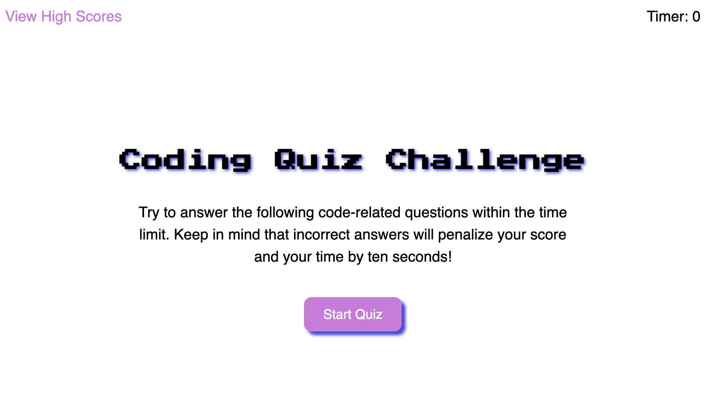

# Code Quiz

## Website Description
The website is of a coding quiz which gives multiple choice options as answers. It is initiated by a start button and a timed assessmenet of 35 seconds. If the user misses an an answer 10 seconds are subtracted from the time and if they get one correct answer then 10 seconds are added. They are shown whether they got an answer correct or not before moving to the next question. If they run out of time, they will see a "Game Over" end page message. If they make it in time they are given a score as an end page. Either way they are asked to submit their initials and upon clicking submit are brought to high scores page where they can then restart the quiz or clear the scores.

## Challenge Description
The challenge required dynamically updated HTML via JavaScript and CSS styling. There was no starter code provided. Various divs are shown and hidden dependent on which section of the quiz the user is on and which button has been pressed. The questions and answers are not on the HTML but rather populated to be shown on the screen via an array. An event listener on the start button initiates the timer countdown function on the screen for the user to see while each question appears via appending the question container div and they make a multiple choice selection from li items in an unordered list. Event listener functions are also on the high scores, clear scores, and restart buttons. The timer stops and returns to zero if the user runs out of time or if the quiz is not currently running. Otherwise it uses an interval of one second to subtract down from 35.  The quiz will end with the result div; this is either a "Game Over" screen if they run out of time or results of how many questions they got correct. The restart quiz function resets most global variables for time, score, and questions index. The high scores also used an array to check which is the highest and order them as such. At the end page, they are given a submit button for initials with an event listener that then shows highscores in proper order.

## User Story

```
AS A coding boot camp student
I WANT to take a timed quiz on JavaScript fundamentals that stores high scores
SO THAT I can gauge my progress compared to my peers
```

## Acceptance Criteria

```
GIVEN I am taking a code quiz
WHEN I click the start button
THEN a timer starts and I am presented with a question
WHEN I answer a question
THEN I am presented with another question
WHEN I answer a question incorrectly
THEN time is subtracted from the clock
WHEN all questions are answered or the timer reaches 0
THEN the game is over
WHEN the game is over
THEN I can save my initials and my score
```

## Tasks Completed
The HTML document includes:
* a proper title and SEO metadata
* proper HTML semantic labelling
* alt attributes of images for accessibility
* countdown timer, next button, question container
* comments

The CSS document includes:
* an organized structure that matches the HTML order
* variables for repetitive values
* visually appealing styling
* element and class selectors
* comments

The JavaScript document includes:
* variables, query selectors, objects, event listeners, and functions
* start/restart/multiple choice/high scores/clear scores button event listeners on click
* Questions array 
* High scores array
* intervals, countdown timers, functions with parameters, functions with appended lists and classes

## Languages
- HTML
- CSS
- JavaScript

## Links
* [Deployed webpage](https://villette0.github.io/M4C-Code_Quiz/)

* [Repository](https://github.com/villette0/M4C-Code_Quiz)

## Screenshot


